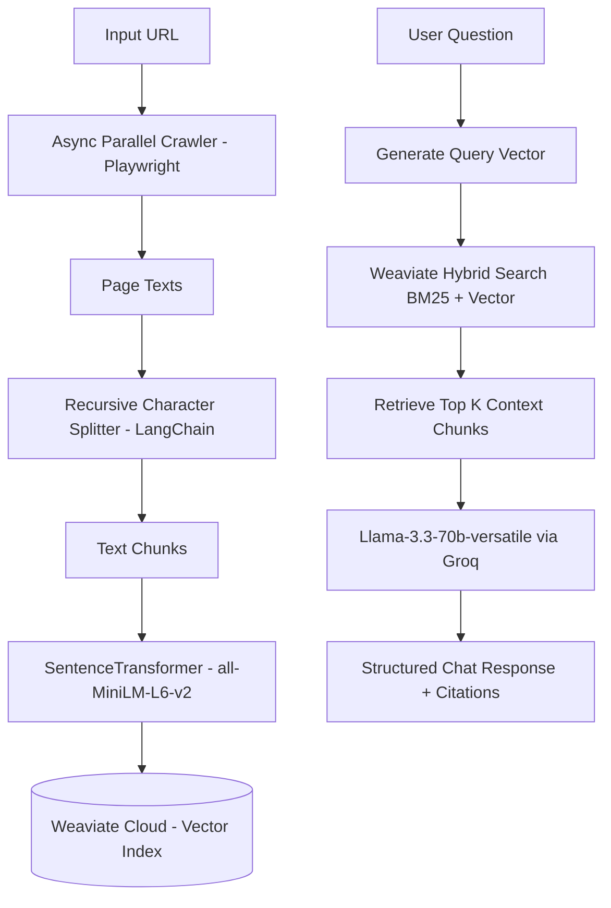

# WebRAGG: Conversational Web RAG Chatbot

WebRAGG is a premium, mobile-responsive web application built using Streamlit. It allows users to scrape any website, index its content into a vector database, and immediately start a conversational Q&A chat based on the crawled content.

The system uses **Weaviate Cloud Services (WCD)** for cloud-hosted vector storage and **Groq Cloud (Llama 3.3 70B)** for lightning-fast retrieval-augmented generation (RAG) responses.

---

## Key Features

* **Parallel Web Scraper:** Utilizes Python's `asyncio` and `Playwright` to crawl pages concurrently, respecting domain constraints and ignoring junk assets (PDFs, images, etc.).
* **Smart Content Chunking:** Uses LangChain's `RecursiveCharacterTextSplitter` to partition page text into optimized chunks with configured overlapping.
* **Hybrid Search Retrieval:** Queries the vector database using Weaviate's **Hybrid Search** (combining semantic vector search and classic BM25 keyword search) for maximum context accuracy.
* **Local Embeddings:** Generates vector representations locally in-memory using `SentenceTransformer` (`all-MiniLM-L6-v2`) before securely uploading them to the cloud.
* **Premium Responsive UI:** Features animations, automated font sizing for mobile viewports, dynamic metric cards, and a live indexing pulse status badge.

---

## Architecture & Solution Approach



### 1. Ingestion Phase
* The user enters a starting URL and specifies maximum pages to index.
* **Playwright** crawls the domain concurrently. The scraper extracts internal links, normalizes URLs, filters out junk resource types, and gathers body text.
* Text content is split into 1000-character chunks with a 200-character overlap.
* The chunks are embedded locally using `all-MiniLM-L6-v2` and batched into a cloud-hosted Weaviate schema.

### 2. Query & Generation Phase (RAG)
* When a question is typed, the user's query is converted to a vector embedding locally.
* Weaviate performs a **Hybrid Search** (weighted 50% semantic and 50% BM25 keyword) to locate the top `k` most relevant chunks.
* The matching text fragments are concatenated into a context prompt.
* **Llama-3.3-70b-versatile** via the **Groq API** answers the question *only* using the provided context and returns citations of the source URLs.

---

## Prerequisites

* **Python 3.10 to 3.13** installed on your system.
* A **Weaviate Cloud (WCD)** sandbox/cluster URL and API key.
* A **Groq Cloud** API key.

---

## Setup & Installation

Follow these steps to run the project locally:

### 1. Clone the Repository
```bash
git clone <repository-url>
cd RAGG
```

### 2. Set Up a Virtual Environment
**On Windows:**
```powershell
python -m venv .venv
.\.venv\Scripts\Activate.ps1
```
**On macOS/Linux:**
```bash
python3 -m venv .venv
source .venv/bin/activate
```

### 3. Install Dependencies
```bash
pip install -r requirements.txt
```

### 4. Install Playwright Browsers
Playwright requires browser binaries to execute scraping tasks. Download Chromium by running:
```bash
playwright install chromium
```

### 5. Configure Environment Variables
Create a file named `.env` in the root directory and specify your API credentials:
```env
API-KEY=your_groq_api_key_here
WEAVIATE_URL=https://your-cluster-subdomain.weaviate.cloud
WEAVIATE_API_KEY=your_weaviate_api_key_here
```

---

## Usage

1. Start the Streamlit server:
   ```bash
   streamlit run app.py
   ```
2. Open the URL provided in the console (usually `http://localhost:8501`).
3. Enter a target website (e.g., `https://docs.streamlit.io`), choose pages to scrape, and click **Process & Index Site**.
4. Once indexing is complete, ask questions directly in the chat panel!

# RAG-chatbot


## Setup

clone this repo

You will need a virual environment to run this
python -m venv venv
venv\Scripts\activate   # Windows

ADD an API key. aste this in a file name .env (this file should be in same folder as the main and other files required for this project)

## Dependencies

python version: python 3.13

python libraries required:
py -m pip install playwright
py -m pip install langchain
py -m pip install langchain-openai
py -m pip install langchain-text-splitters
py -m pip install sentence-transformers
py -m pip install faiss-cpu
py -m pip install python-dotenv
